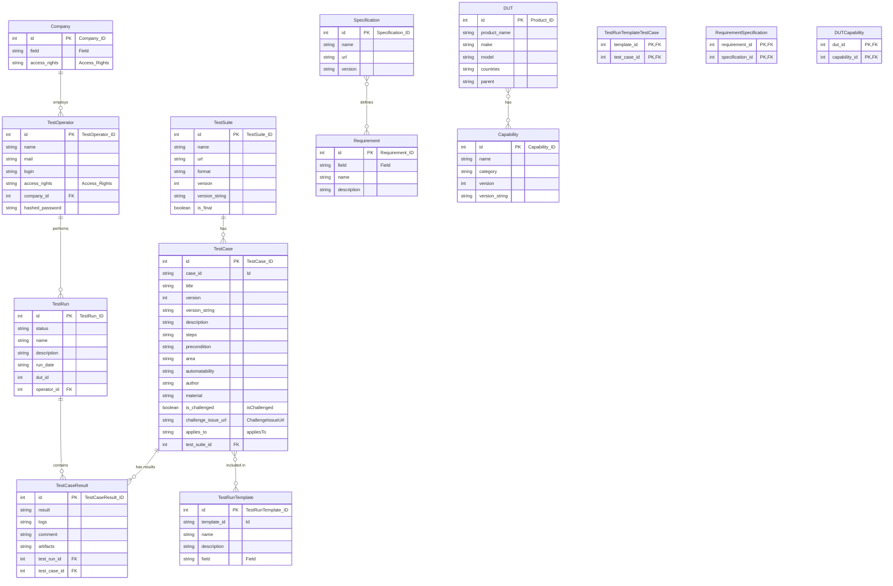

# Database Schema ER Diagram

```mermaid
erDiagram
    TestSuite ||--o{ TestCase : "has"
    TestCase ||--o{ TestCaseResult : "has results"
    TestCase }o--o{ TestRunTemplate : "included in"
    TestRun ||--o{ TestCaseResult : "contains"
    TestOperator ||--o{ TestRun : "performs"
    Company ||--o{ TestOperator : "employs"
    Specification }o--o{ Requirement : "defines"
    DUT }o--o{ Capability : "has"

    TestSuite {
        int id PK "TestSuite_ID"
        string name
        string url
        string format
        int version
        string version_string
        boolean is_final
    }

    TestRunTemplate {
        int id PK "TestRunTemplate_ID"
        string template_id "Id"
        string name
        string description
        string field "Field"
    }

    TestCase {
        int id PK "TestCase_ID"
        string case_id "Id"
        string title
        int version
        string version_string
        string description
        string steps
        string precondition
        string area
        string automatability
        string author
        string material
        boolean is_challenged "isChallenged"
        string challenge_issue_url "ChallengeIssueUrl"
        string applies_to "appliesTo"
        int test_suite_id FK
    }

    TestRunTemplateTestCase {
        int template_id PK,FK
        int test_case_id PK,FK
    }

    Company {
        int id PK "Company_ID"
        string field "Field"
        string access_rights "Access_Rights"
    }

    TestOperator {
        int id PK "TestOperator_ID"
        string name
        string mail
        string login
        string access_rights "Access_Rights"
        int company_id FK
        string hashed_password
    }

    TestCaseResult {
        int id PK "TestCaseResult_ID"
        string result
        string logs
        string comment
        string artifacts
        int test_run_id FK
        int test_case_id FK
    }

    TestRun {
        int id PK "TestRun_ID"
        string status
        string name
        string description
        string run_date
        int dut_id
        int operator_id FK
    }

    Specification {
        int id PK "Specification_ID"
        string name
        string url
        string version
    }

    Requirement {
        int id PK "Requirement_ID"
        string field "Field"
        string name
        string description
    }

    RequirementSpecification {
        int requirement_id PK,FK
        int specification_id PK,FK
    }

    Capability {
        int id PK "Capability_ID"
        string name
        string category
        int version
        string version_string
    }

    DUT {
        int id PK "Product_ID"
        string product_name
        string make
        string model
        string countries
        string parent
    }

    DUTCapability {
        int dut_id PK,FK
        int capability_id PK,FK
    }
```